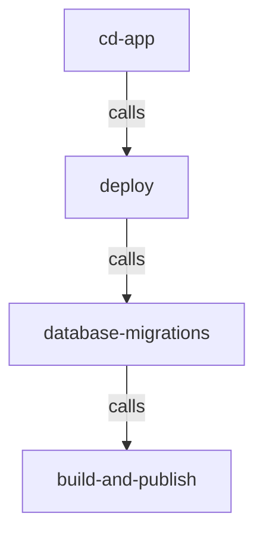

# CI/CD

The CI/CD for this project uses [reusable Github Actions workflows](https://docs.github.com/en/actions/using-workflows/reusing-workflows).

## 🧪 CI

### Per app workflows

Each app should have:

- `ci-[app_name]`: must be created; should run linting and testing
- `ci-[app_name]-vulnerability-scans`: calls `vulnerability-scans`
- `ci-[app_name]-pr-environment-checks.yml`: calls `pr-environment-checks.yml` to create or update a pull request environment (see [pull request environments](/docs/infra/pull-request-environments.md))
- `ci-[app_name]-pr-environment-destroy.yml`: calls `pr-environment-destroy.yml` to destroy the pull request environment (see [pull request environments](/docs/infra/pull-request-environments.md))

### App-agnostic workflows

- [`ci-infra`](./ci-infra.yml): run infrastructure CI checks

## 🚢 CD

Each app should have:

- `cd-[app_name]`: deploys an application

The CD workflow uses these reusable workflows:

- [`deploy`](./deploy.yml): deploys an application
- [`database-migrations`](./database-migrations.yml): runs database migrations for an application
- [`build-and-publish`](./build-and-publish.yml): builds a container image for an application and publishes it to an image repository

## ⛑️ Helper workflows

- [`check-ci-cd-auth`](./check-ci-cd-auth.yml): verifes that the project's Github repo is able to connect to AWS
