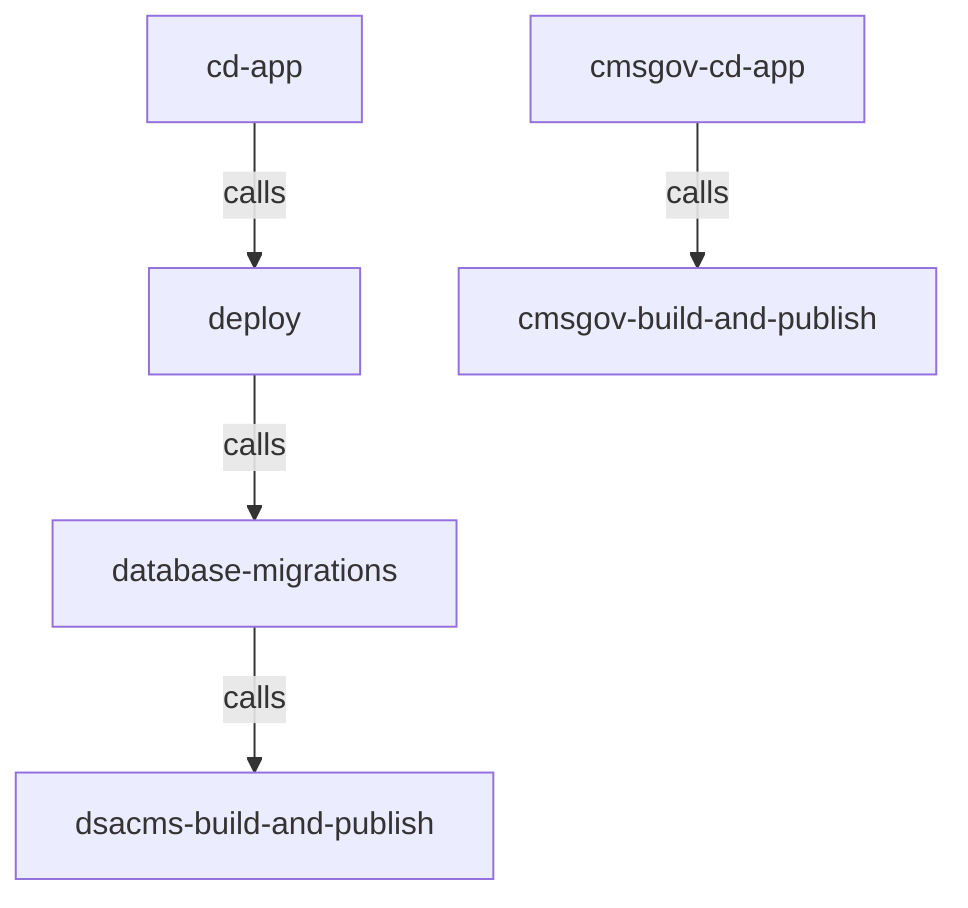

# CI/CD

The CI/CD for this project uses [reusable Github Actions workflows](https://docs.github.com/en/actions/using-workflows/reusing-workflows).

## 🧪 CI

### Per app workflows

Each app should have:

- `ci-[app_name]`: must be created; should run linting and testing
- `ci-[app_name]-vulnerability-scans`: calls `vulnerability-scans`
  - Based on [ci-app-vulnerability-scans](https://github.com/navapbc/template-infra/blob/main/.github/workflows/ci-%7B%7Bapp_name%7D%7D-vulnerability-scans.yml.jinja)
- `ci-[app_name]-pr-environment-checks.yml`: calls `pr-environment-checks.yml` to create or update a pull request environment (see [pull request environments](/docs/infra/pull-request-environments.md))
  - Based on [ci-app-pr-environment-checks.yml](https://github.com/navapbc/template-infra/blob/main/.github/workflows/ci-%7B%7Bapp_name%7D%7D-pr-environment-checks.yml.jinja)
- `ci-[app_name]-pr-environment-destroy.yml`: calls `pr-environment-destroy.yml` to destroy the pull request environment (see [pull request environments](/docs/infra/pull-request-environments.md))
  - Based on [ci-app-pr-environment-destroy.yml](https://github.com/navapbc/template-infra/blob/main/.github/workflows/ci-%7B%7Bapp_name%7D%7D-pr-environment-destroy.yml.jinja)

### App-agnostic workflows

- [`ci-docs`](./ci-docs.yml): runs markdown linting on all markdown files in the file
  - Configure in [markdownlint-config.json](./markdownlint-config.json)
- [`ci-infra`](./ci-infra.yml): run infrastructure CI checks

## 🚢 CD

Each app should have:

- `cd-[app_name]`: deploys an application
  - Based on [`cd-app`](https://github.com/navapbc/template-infra/blob/main/.github/workflows/cd-%7B%7Bapp_name%7D%7D.yml.jinja)

The CD workflow uses these reusable workflows:

- [`deploy`](./deploy.yml): deploys an application
- [`database-migrations`](./database-migrations.yml): runs database migrations for an application
- [`dsacms-build-and-publish`](./dsacms-build-and-publish.yml): DSACMS-only reusable workflow that builds a container image for an application and publishes it to ECR
- [`cmsgov-build-and-publish`](./cmsgov-build-and-publish.yml): CMSgov-only reusable workflow that builds a container image for an application and publishes it to Artifactory
- [`cmsgov-cd-app`](./cmsgov-cd-app.yml): CMSgov-only top-level workflow that publishes the `app` image to `artifactory.cloud.cms.gov/emmy-docker/emmy-app` on `main` pushes and manual dispatch

```mermaid
graph TD
  cd-app
  deploy
  database-migrations
  dsacms-build-and-publish
  cmsgov-cd-app
  cmsgov-build-and-publish

  cd-app-->|calls|deploy-->|calls|database-migrations-->|calls|dsacms-build-and-publish
  cmsgov-cd-app-->|calls|cmsgov-build-and-publish
```

## ⛑️ Helper workflows

- [`check-ci-cd-auth`](./check-ci-cd-auth.yml): verifes that the project's Github repo is able to connect to AWS
