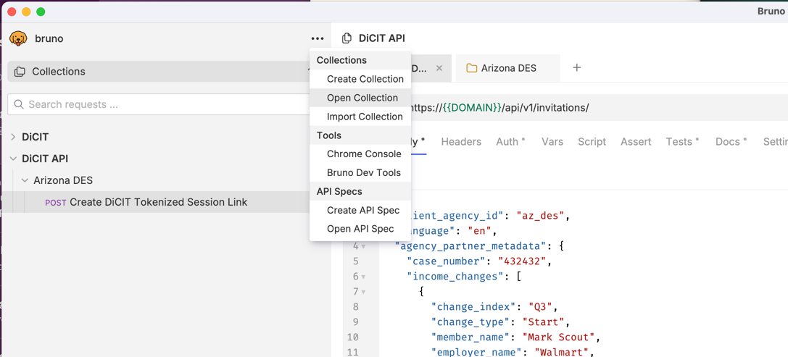

## DiCIT Bruno Collection

This folder is a Bruno collection for interacting with the DiCIT platform API services.

How to use:
1. Clone this repo locally.
2. Download and install the latest copy of [Bruno](https://www.usebruno.com/).
3. Click "Open Collection" and open the current folder: `{repo-location}/api-docs/dicit-bruno-collection` 
4. Copy .env.sample to .env.  Add definitions to all of the variables.
5. In Bruno, click "Arizona DES" -> "Post Create DiCIT Tokenized Session Link".  Select the "demo" environment in the top right.  And submit the request.  This should result in a 201 success message with a tokenized url in the response.