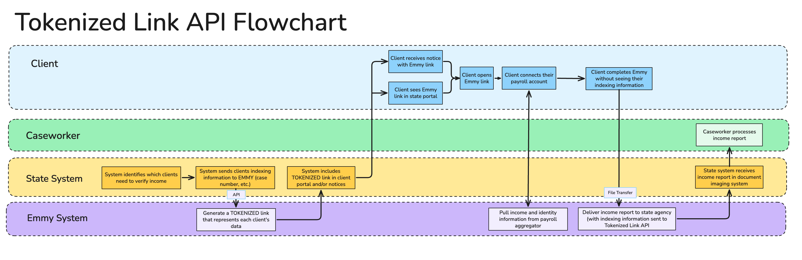

# Tokenized Link API Integration Guide [General]

# **Introduction**

This guide provides high-level technical documentation necessary for a **state agency** to integrate with the Emmy API Version 1.0.

This flowchart shows the connection between a state's system, the Emmy platform, and the ultimate end-user experience for an agency's **clients** (those receiving or applying for benefits from an agency):



# **API Environments**

The Emmy platform currently has three hosted environments where the Tokenized Link API is accessible:

| Environment Name | Base URL | Description |
| :-- | :-- | :-- |
| Production | https://[agency_subdomain].reportmyincome.org/ | Production website with live agencies |
| Demo | https://demo.reportmyincome.org/ | Used for demoing Emmy to states and matches our production site. |
| Dev | https://verify-demo.navapbc.cloud/ | Our only lower environment and can be used for development and testing latest changes. |

The Emmy Tokenized Link API is only accessible over HTTPS.

# **Authentication**

Authentication to API endpoints is provided with a header:

```
Authorization: Bearer API_KEY
```

The API\_KEY is a 32 character secret that should not be disclosed publicly. Partner agencies will receive a unique API\_KEY for each environment.

If a request is not authenticated with a valid API\_KEY, the server will respond with a **401 Unauthorized** response.

If the API\_KEY is compromised, email us immediately (EMMY@cms.hhs.gov) and we can disable the old API\_KEY and generate a new one.

# **Endpoints**

The API currently contains only one endpoint.

## **POST /api/v1/invitations** (Create an Emmy Tokenized Session Link)

This API endpoint creates a new "invitation" to use Emmy, which associates an applicant's *indexing metadata* with a *tokenized link* for that user to initiate the session. Invitation links may be sent by the agency to the applicant by any method defined as part of the pilot, including when:

* The client clicks a button to go to Emmy,
* A request for verifications is processed by the agency's systems, or
* Sending a notice to a user by SMS/Email

After the applicant follows the link, the payroll data they link during the session will be transmitted back to the partner agency with the indexing information provided to this endpoint.

### **API Fields**

| Field Name | Required? | Description |
| :-- | :-- | :-- |
| **Request Fields** |  |  |
| language | No | Applicant's preferred written language, if known. When provided, the Emmy session will automatically begin in this language if we support this language. When omitted, will default to "en". Formatted as ISO 639-1 (2-character) code. |
| agency_partner_metadata | Yes | Agency-specific metadata fields that will be used for indexing the income report in the document imaging system after it is sent back to the state agency. The specific indexing fields sent by an agency will be identified during an implementation call. Sample fields sent by some state agencies include `case_number` (String), `date_of_birth` (Date String), `doc_id` (String) |
| **Response Fields** |  |  |
| url | Yes | A unique URL containing a token that represents the session corresponding to the metadata submitted in the request.The URL is valid until 11:59:59 p.m. Eastern Time of the 14th day after its creation. |
| expiration_date | Yes | Expiration date of the URL, formatted as an ISO8601 datetime. After this date, the user would need to use a new tokenized URL to access Emmy. |
| language | Yes | Language code that the user will begin Emmy in. This will match the requested language if Emmy supports the language. Otherwise, it will fall back to "en" (English). |
| agency_partner_metadata | Yes | Object including all agency-specific metadata fields used for indexing the income report. Values will match whatever is provided in the request's `agency_partner_metadata` field. |

### **Sample Request Payload:**

This sample demonstrates a request to the API for a client reporting a loss of their job at Target and starting a new job at Walmart.

```
{
  "language": "en", // optional - Valid values: "en" or "es". Default: "en" (english)
  "agency_partner_metadata": {
    "case_number": "432432" // required, depending on agency indexing data configuration
  }
}
```

### **Sample Response:**

```
201 Created
{
  "url": "https://verify-demo.navapbc.cloud/en/cbv/entry?token=ABC123456",
  "expiration_date": "2025-01-01T23:59:59.999-05:00",
  "language": "en",
  "agency_partner_metadata": {
    "case_number": "432432"
  }
}
```

After receiving the response, the agency should direct the applicant to the **url** value in the response to begin the Emmy session. If the URL is stored by the agency's system, it should not be given to an applicant after the **expiration\_date** (14 days by default) – rather, a new Tokenized Session Link should be requested for that applicant.

### **Example curl command:**

```
curl \
  -H "Content-Type: application/json" \
  -H "Authorization: Bearer [api_token]" \
  -d '{ "language": "en", "agency_partner_metadata": { "case_number": "34243" } }' \
  https://verify-demo.navapbc.cloud/api/v1/invitations
```

### **Sample curl command for sandbox on Demo:**

Note: If you encounter issues, please check [the current client agency config](https://github.com/DSACMS/iv-cbv-payroll/blob/main/app/config/client-agency-config.yml) to ensure the required `agency_partner_metadata`  is up to date for the agency corresponding to your `api_token` .

```
curl \
  -H "Content-Type: application/json" \
  -H "Authorization: Bearer [api_token]" \
  -d '{ "language": "en", "agency_partner_metadata": { "first_name": "Jane", "last_name": "Doe", "case_number": "123", "date_of_birth": "01/01/1990" } }' \
  https://demo.reportmyincome.org/api/v1/invitations
```

# **Response Statuses**

* **201 Created** – The API call successfully created a tokenized link.
* **401 Unauthorized** - An incorrect API token was given.
* **422 Unprocessable Entity** - Some required fields were missing, or had an incorrect format. Check the response body's values for attribute-specific error messages.

# **Tokenized Link Origin Tracking**

In general, Emmy Tokenized Links should not be modified, except for the purposes of origin tracking. Emmy supports an additional query parameter, `origin`, that allows the Emmy team to calculate click-through-rate for a specific place that the link will appear. This is useful when the link will be shown to the user in multiple locations.

The agency must add the origin parameter when displaying the link to a client. To add it, the agency will concatenate the string "&origin=\[value\]" onto the end of the Tokenized URL, with "\[value\]" replaced with a valid value as listed below.

For example, an Emmy link may be modified like this before directing the user to it:

| Example of adding an origin tracking parameter: |
| :-- |
| https://verify-demo.navapbc.cloud/en/cbv/entry?token=sWr3DfLhfMuSGvN6x7htZWcWFjAcFLqu2ggf |
| https://verify-demo.navapbc.cloud/en/cbv/entry?token=sWr3DfLhfMuSGvN6x7htZWcWFjAcFLqu2ggf&origin=email |

Note

The specific origin values supported will be determined in an implementation call with your agency.

For example, here are origin values used in the past with other agencies:

| Origin Value | Description |
| :-- | :-- |
| email | Added to the Emmy link that gets sent via email. |
| documents | Added to the Emmy link when the client clicks on the link in the "Documents" page of the state portal. |
| dashboard | Added to the Emmy link when the client clicks on the link on the state portal's dashboard. |
