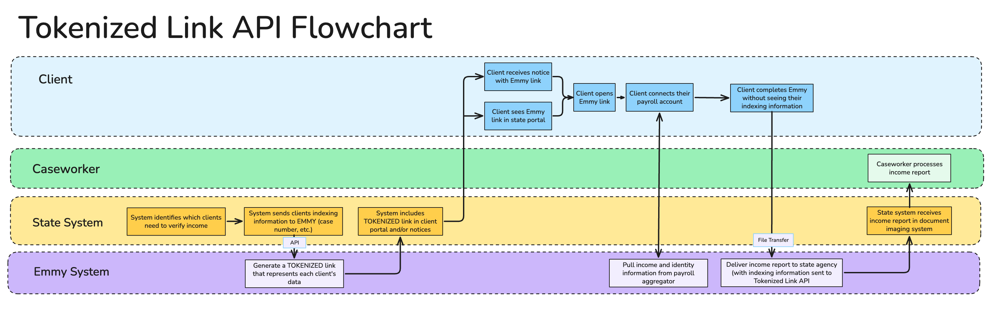

# Tokenized Link API Integration Guide

Create personalized links that applicants use to begin reporting income and,
when enabled for an agency, community engagement activities in Emmy.

This guide covers `POST /api/v1/invitations` (`Api::InvitationsController`).
The [OpenAPI contract](openapi.json) contains the field schemas and tested
request/response examples. V2 invitations and outbound report payloads are
separate interfaces; see the [API documentation index](README.md).



## API environments

| Environment | Base URL | Purpose |
| :-- | :-- | :-- |
| Dev | https://verify-demo.navapbc.cloud | Develop and test integrations against the latest changes. |
| Demo | https://demo.reportmyincome.org | Demonstrate and evaluate the platform. |

Use HTTPS for every API request. Use the API key issued for the selected
environment. Your production hostname and credentials are provided during
agency onboarding.

## Access and authentication

Contact [emmy@cms.hhs.gov](mailto:emmy@cms.hhs.gov) to request an agency API key
for each environment. The Tokenized Link API uses a 32-character secret API key.
Keep it on your server, do not put it in browser code or public repositories,
and send it with each request using the `Authorization` header below.

Each key identifies an agency and its configured indexing fields and invitation
settings. `client_agency_id` in the request cannot select another agency.
Send JSON request bodies with `Content-Type: application/json`.

```http
Authorization: Bearer API_KEY
Content-Type: application/json
```

A missing or invalid key returns `401 Unauthorized` with a plain-text body,
`HTTP Token: Access denied.`, and a `WWW-Authenticate` header. If a key is
compromised, contact emmy@cms.hhs.gov to have it replaced.

## Create an invitation

Send a JSON object to `POST /api/v1/invitations`:

| Field | Required? | Description |
| :-- | :-- | :-- |
| `language` | Yes | `en` or `es`, case insensitive. Returned in lowercase. Missing or unsupported values return `422`; there is no default or fallback. |
| `agency_partner_metadata` | Yes | An object containing the indexing fields agreed during agency onboarding. See below. |
| `activities` | No | An array of prefilled activities. Ignored unless prefilled activities are enabled for the agency. A nonempty, valid array creates an additional activity invitation. |

The endpoint creates invitations without sending email or SMS. The agency
delivers the returned link or redirects the applicant to it. Each request
creates a new invitation; there is no idempotency key or deduplication.

### Agency metadata

Metadata links a submitted report back to the agency's records. Send the fields
agreed during onboarding. Current V1 field sets are:

| Agency | Accepted fields |
| :-- | :-- |
| Sandbox, New Hampshire | `first_name`, `middle_name`, `last_name`, `case_number`, `date_of_birth` |
| Louisiana | `case_number`, `date_of_birth`, `doc_id` |
| Research | `case_number`, `date_of_birth` |
| Accenture | `case_number` |

The agency's [configuration](../../app/config/client-agency-config.yml) defines
its indexing requirements. The shared OpenAPI metadata schema describes the
union of these fields, so schema validation alone cannot check agency-specific
requirements. Sandbox and New Hampshire invitations require first and last
names. Supply dates of birth as `MM/DD/YYYY`; Louisiana case numbers are limited
to 13 characters.

Unrecognized fields and `individual_id` are ignored by this V1 endpoint. The
response contains all accepted fields for the agency, with `null` for omitted
values. Metadata values are echoed as supplied, including date strings.

### Example request

This synthetic example uses sandbox metadata in the Dev environment. Substitute
the API key provided during onboarding; select the Demo hostname when using Demo.

```bash
curl --request POST "https://verify-demo.navapbc.cloud/api/v1/invitations" \
  --header "Authorization: Bearer $EMMY_API_KEY" \
  --header "Content-Type: application/json" \
  --data '{
    "language": "en",
    "agency_partner_metadata": {
      "first_name": "Jane",
      "last_name": "Doe",
      "case_number": "EXAMPLE-123",
      "date_of_birth": "01/15/1990"
    }
  }'
```

### Successful response

`201 Created` returns JSON:

```json
{
  "tokenized_url": "https://verify-demo.navapbc.cloud/en/start/IncomeExampleToken",
  "expiration_date": "2026-10-07T23:59:59.999-04:00",
  "language": "en",
  "agency_partner_metadata": {
    "first_name": "Jane",
    "middle_name": null,
    "last_name": "Doe",
    "case_number": "EXAMPLE-123",
    "date_of_birth": "01/15/1990"
  }
}
```

### Link lifetime

Direct the applicant to `tokenized_url` to report income. Treat the token as
opaque. The `expiration_date` applies to this income link: the end of the day in
`America/New_York` after the agency's configured validity period. For example,
the sandbox uses 14 days; other agencies may differ. Request a new invitation
when a link expires.

### Prefilled activities

When enabled for an agency, include an `activities` array. The API accepts these
types, provided the activity type is also enabled for the agency:

| Type | Required fields in each entry, in addition to `type` |
| :-- | :-- |
| `volunteering` | `organization_name` |
| `employment` | `employer_name` |
| `education` | `school_name` |
| `job_training` | `program_name`, `organization_name` |

The OpenAPI reference describes each type's address, contact, and monthly fields.

Monthly entries are optional. Use `YYYY-MM-DD` for `month`, preferably the first
day of the month. Dates must fall within the agency's application reporting
window when the invitation is created. For the sandbox in September 2026, that
window is July 1 through August 31. Adjust example dates for live requests.
Hours represent activity hours, except for education, where they represent
credit hours. Employment gross income is in dollars. This endpoint checks month
dates; numeric validation happens later in the reporting flow.

A successful response adds `activity_tokenized_url`, the link to start community
engagement reporting. It still includes the income `tokenized_url`. The activity
link currently has no time-based expiration; `expiration_date` describes only
the income link. An omitted or empty activities array produces only an income
invitation. When prefilled activities are disabled, the array is ignored and
`activity_tokenized_url` is omitted.

## Validation errors

`422 Unprocessable Content` returns an `errors` array with `field` and `message`
for each validation error. For example:

```json
{
  "errors": [
    {
      "field": "language",
      "message": "Language must be either English (en) or Spanish (es)."
    }
  ]
}
```

Field paths can include `language`, `cbv_applicant.first_name`,
`agency_partner_metadata.*`, or indexed activity paths such as
`activities[0].months[0].month`. Do not depend on exact message wording.
The OpenAPI reference includes tested examples for authentication, language,
and applicant validation errors.

An activity validation failure occurs **after the income invitation has been
saved**. A retry creates another income invitation. The error response does
not include the earlier invitation's link.

Always supply a JSON object for `agency_partner_metadata` and an array of objects
for `activities`. Missing metadata or malformed containers are not covered by
the structured `422` response; the current endpoint may raise a server error.

## Origin tracking

To track where an applicant received a link, add an `origin` query parameter
using a value agreed during onboarding (for example, `email` or `dashboard`).
Use `?` if the URL has no query string and `&` if it already has one:

```text
https://verify-demo.navapbc.cloud/en/start/IncomeExampleToken?origin=email
```

## Building the API reference

After [setting up the Rails application](../../CONTRIBUTING.md#setup), run from
the `app/` directory with PostgreSQL available:

```bash
bundle install
npm ci
RAILS_ENV=test bundle exec rake api_docs:build
```

This command executes the rswag request specs against the test database,
validates the OpenAPI document, updates [openapi.json](openapi.json), and builds
a static Scalar site in `app/tmp/api-docs/`. Open `index.html` directly in a
browser. The directory includes its own assets and can be shared or hosted on
a static site without Rails or a CDN. The viewer does not submit API requests.
Scalar uses its modern layout with a light theme and a light/dark toggle.
Its browser bundle is installed through the npm lockfile; the build copies it
into the site, and fonts use the system defaults so the reference works offline.

The RSpec CI workflow repeats this build, rejects changes that leave the
checked-in OpenAPI contract stale, and uploads an `api-reference` artifact.
Download and extract that artifact to review the rendered documentation.
Commit the regenerated `docs/api/openapi.json` whenever the contract changes.

### Maintaining the contract

- Define operations and executable examples in
  [the invitation request specs](../../app/spec/requests/api/invitations_spec.rb).
- Keep shared document settings in
  [swagger_helper.rb](../../app/spec/swagger_helper.rb) and reusable invitation
  schemas in [invitation_schemas.rb](../../app/spec/openapi/invitation_schemas.rb).
- This guide supplies the generated page's environment and API-key guidance,
  operation description, and schema descriptions. Rebuild after editing those
  sections so the rendered reference stays in sync.
- The specs validate response schemas and successful example requests. The build
  captures actual response bodies and successful requests; it never records
  authorization headers. Dates, hostnames, and example tokens are fixed for
  repeatable output using synthetic data.
- Keep existing controller tests for implementation edge cases. The rswag request
  specs exercise the HTTP contract and run in the normal test suite too.
- Run `bundle exec rspec spec/requests/api/invitations_spec.rb` for a focused
  contract check, then rebuild the reference. Edit source specs and schemas,
  rather than the generated JSON.

See [rswag's documentation](https://github.com/rswag/rswag) for its specification
DSL. Additional API objects can add reusable component schemas and request specs
to the same build.
