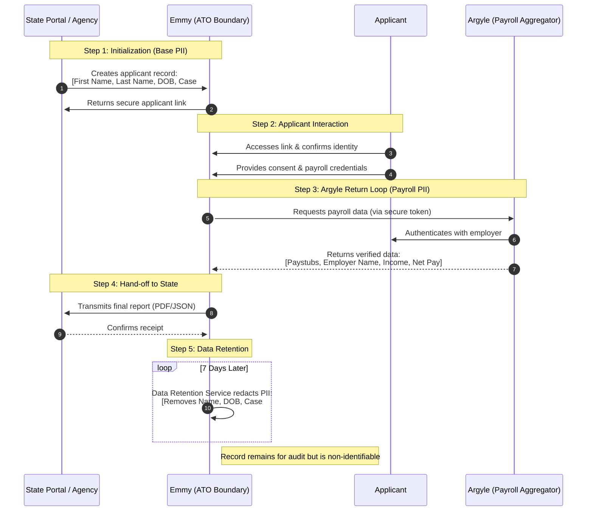

### Emmy Government Data Flow (Sequence Diagram)

This diagram specifies the exact types of PII (Personally Identifiable Information) and payroll data that flow through the system, along with the automated redaction cycle.

### Specific Data Types Collected

#### 1. Primary Identity PII (State to Emmy)
When a state caseworker or portal initializes a flow, the following base information is stored within the Emmy ATO boundary:
*   **Legal Name**: First, Middle (optional), and Last Name.
*   **Date of Birth**: Used for identity verification.
*   **Agency Identifiers**: Case Number or Document ID (to link back to the state's system of record).

#### 2. Payroll & Income Data (Argyle to Emmy)
Once the applicant successfully logs into their payroll provider via Argyle, Emmy retrieves:
*   **Employment Details**: Employer name, job title, and employment status.
*   **Income Details**: Gross pay, net pay, pay frequency, and line-item deductions.
*   **Historical Data**: Up to 90 days of paystubs (depending on agency configuration).

#### 3. 7-Day Redaction Policy
To ensure compliance with data minimization principles:
*   **Trigger**: Exactly 7 days after the data is successfully transmitted to the State, or 7 days after an invitation expires.
*   **Action**: The `DataRetentionService` wipes all identifying strings (Names, Case Numbers) and replaces them with a redacted placeholder.
*   **Outcome**: The database retains a record that a flow occurred (for system metrics), but it can no longer be traced back to a specific individual.